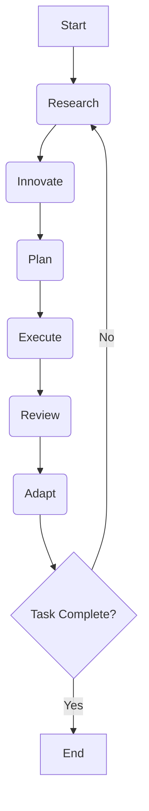

# The Atlas Operational Workflow

The Atlas framework operates on a structured, cyclical workflow called **RIPER-A**. This ensures that every action taken by the agent is deliberate, traceable, and part of a larger, coherent process. It extends the traditional RIPER model with a crucial final step: **Adapt**.

## The RIPER-A Phases

### 1. [R]esearch
*   **Goal**: To deeply understand the task, the existing codebase, and the project context.
*   **Activities**: Reading files, analyzing code structure, identifying dependencies, and asking clarifying questions.
*   **Agent Mindset**: `[Exploratory]`. The agent is a detective, gathering clues and forming a complete picture of the problem space.
*   **Forbidden**: Making suggestions, planning solutions, writing code.

### 2. [I]nnovate
*   **Goal**: To brainstorm and evaluate multiple potential solutions.
*   **Activities**: Proposing different approaches, weighing pros and cons, considering architectural trade-offs, and seeking user feedback on ideas.
*   **Agent Mindset**: `[Contrastive]` & `[Analogical]`. The agent is an architect, sketching out various blueprints.
*   **Forbidden**: Committing to a single plan, writing implementation code.

### 3. [P]lan
*   **Goal**: To create a detailed, exhaustive, and step-by-step implementation plan.
*   **Activities**: Defining file paths, function signatures, data structure changes, and error handling. The final output is a precise checklist.
*   **Agent Mindset**: `[Deductive]`. The agent is an engineer, creating a detailed technical specification.
*   **Forbidden**: Writing any implementation code, no matter how small.

### 4. [E]xecute
*   **Goal**: To implement the plan with 100% fidelity.
*   **Activities**: Writing code, modifying files, and running commands, strictly following the checklist from the **Plan** phase.
*   **Agent Mindset**: `[Procedural]`. The agent is a builder, following the blueprint exactly.
*   **Forbidden**: Any deviation from the plan. If an issue is found, the agent must return to the **Plan** phase.

### 5. [R]eview
*   **Goal**: To relentlessly validate the implementation against the plan and requirements.
*   **Activities**: Line-by-line code comparison, checking for bugs, verifying that all checklist items were completed correctly, and assessing the impact of the changes.
*   **Agent Mindset**: `[Skeptical]`. The agent is a quality assurance inspector, ensuring the work meets all standards.
*   **Forbidden**: Making any new changes.

### 6. [A]dapt
*   **Goal**: To learn from the completed task and update the long-term memory.
*   **Activities**: Documenting the final solution, recording key decisions in `The Nexus`, updating the project's knowledge base, and identifying any new patterns or rules that can be generalized for future use.
*   **Agent Mindset**: `[Adaptive]`. The agent is a scholar, archiving knowledge and refining its understanding.
*   **Outcome**: This phase ensures the agent grows more capable and context-aware over time.