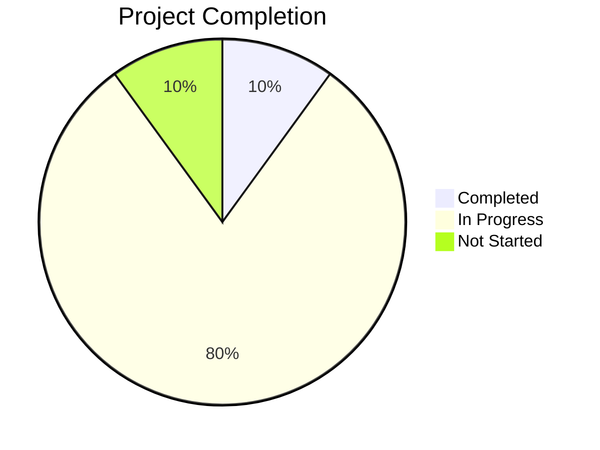

# σ₅: Progress Tracker
*v1.0 | Created: 6/3/2025 | Updated: 6/3/2025*
*Π: INITIALIZING | Ω: RIPERsigma*

## 📈 Project Status
Completion: 10%

## ✅ What Works
[F₁] [✅] Project setup and initialization - Completed project setup and removed MEMORY feature.

## ⏳ What's In Progress
[F₂] [⏳30%] Architecture definition - Defining the system architecture and components.
[F₃] [⏳60%] Technology selection - Selecting appropriate technologies for the project.

## 🔜 What's Left To Build
[F₄] [🔜] [HIGH] Implementation - Implementing the core features of the project.
[F₅] [🔜] [MED] Testing - Developing and running tests to ensure functionality.

## ⚠️ Known Issues
[I₁] [⚠️] [HIGH] Architecture definition - Need to finalize the architecture and components.
[I₂] [⚠️] [LOW] Technology selection - Need to confirm the selected technologies.

## 🏁 Milestones
[M₁] [2025-05-01] [⏳] Project setup and initialization - Completed.
[M₂] [2025-06-01] [🔜] Architecture definition - In progress.